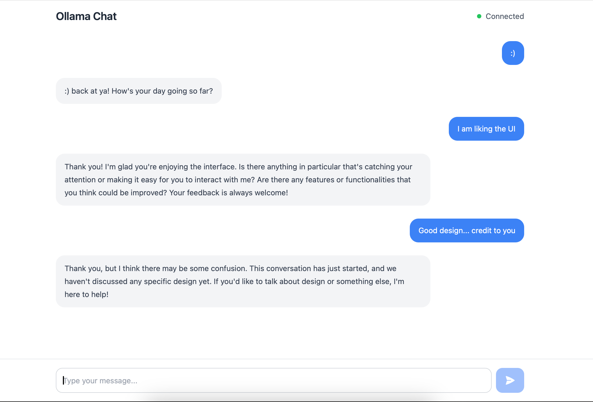

# Ollama Chat

A modern, responsive chat interface for interacting with Ollama AI models. Built with React, Vite, and Tailwind CSS, this application provides a clean and intuitive way to interact with your local Ollama models.



## Features

- 🚀 Modern React application built with Vite
- 💅 Sleek UI with Tailwind CSS
- 📝 Markdown support for messages
- ⌨️ Code syntax highlighting
- 🔄 Real-time streaming responses
- ⏱️ Request timeout handling
- ❌ Ability to cancel ongoing requests
- 🎨 Clean and responsive design
- 🔍 Clear error messages and status indicators

## Prerequisites

Before running this application, make sure you have:

1. [Node.js](https://nodejs.org/) (v16 or higher)
2. [Ollama](https://ollama.ai/) installed and running locally
3. At least one Ollama model pulled (e.g., `llama3.2:latest`)

## Installation

1. Clone the repository:
   ```bash
   git clone <repository-url>
   cd ai-chat
   ```

2. Install dependencies:
   ```bash
   npm install
   ```

3. Start the development server:
   ```bash
   npm run dev
   ```

4. Open your browser and navigate to `http://localhost:5173`

## Configuration

The application is configured to work with a local Ollama instance by default. Make sure Ollama is running before starting the chat.

To verify Ollama is running, you can use:
```bash
ollama list
```

To pull the required model:
```bash
ollama pull llama3.2:latest
```

## Usage

1. Start the application using `npm run dev`
2. Type your message in the input field
3. Press Enter or click the send button to submit
4. The AI model will stream its response in real-time
5. You can cancel any ongoing response by clicking the "Cancel" button

## Development

### Available Scripts

- `npm run dev` - Start development server
- `npm run build` - Build for production
- `npm run preview` - Preview production build
- `npm run lint` - Run ESLint

### Project Structure

```
ai-chat/
├── src/
│   ├── App.jsx        # Main application component
│   ├── main.jsx       # Application entry point
│   └── index.css      # Global styles
├── public/            # Static assets
├── index.html         # HTML template
├── vite.config.js     # Vite configuration
├── tailwind.config.js # Tailwind CSS configuration
└── package.json       # Project dependencies and scripts
```

### Technologies Used

- [React](https://reactjs.org/)
- [Vite](https://vitejs.dev/)
- [Tailwind CSS](https://tailwindcss.com/)
- [React Markdown](https://github.com/remarkjs/react-markdown)
- [Heroicons](https://heroicons.com/)

## Error Handling

The application includes comprehensive error handling for common scenarios:

- Ollama server not running
- Model not found/not installed
- Network connectivity issues
- Request timeouts
- Invalid responses

Error messages are displayed prominently and include helpful troubleshooting steps.

## Contributing

Contributions are welcome! Please feel free to submit a Pull Request.

## License

This project is licensed under the MIT License - see the [LICENSE](LICENSE) file for details.

## Acknowledgments

- [Ollama](https://ollama.ai/) for providing the AI model server
- [Origin UI](https://originui.com/) for design inspiration
- All the open-source libraries that made this project possible

## Support

If you encounter any issues or have questions, please file an issue in the GitHub repository.
